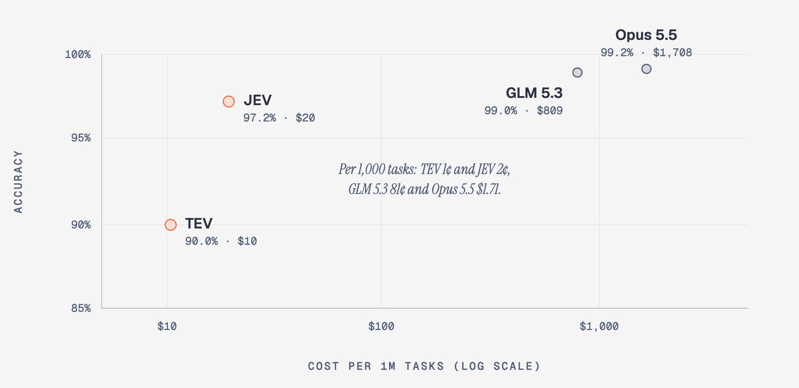
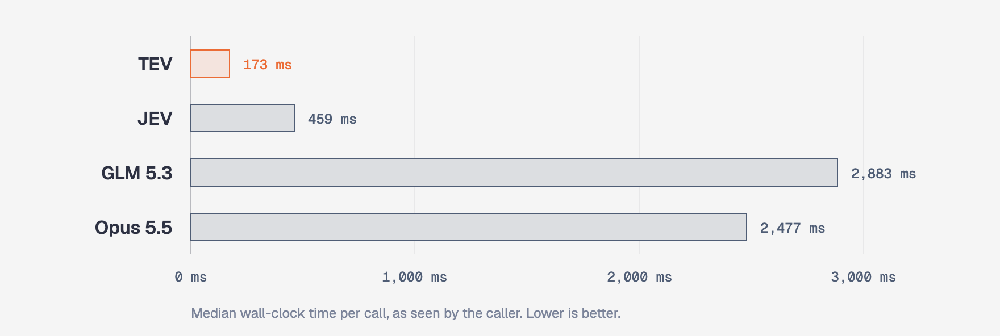
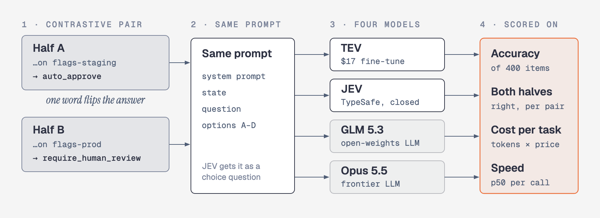
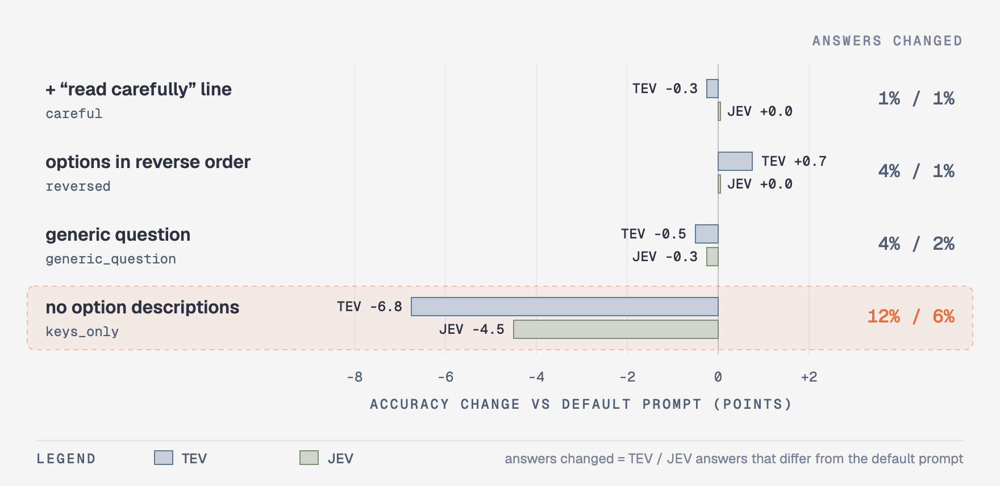

# JEV vs TEV

[Jev](https://flaviocopes.com/jev/) is TypeSafe's closed-source decision model. Together AI [trained a Jev-style model for $17](https://www.together.ai/blog/how-to-train-your-own-jev), `Tev1-4B-experimental` ([announcement](https://www.linkedin.com/feed/update/urn:li:activity:7508652815490105344)), but published no accuracy numbers. We tested it: same 400 new tasks for both models, with two frontier LLMs alongside for reference.

## Recommendation

<!-- ROUTING:START -->
**Use JEV for every task, and re-ask GLM 5.3 only for the few answers JEV tends to get wrong.** On tasks held out from tuning, this scores 98.1% against GLM 5.3's 99.0%, and costs 89% less: $86 per million tasks instead of $810.

| Setup | Accuracy | Sent to GLM 5.3 | Cost per 1M tasks | vs GLM 5.3 only | Latency p50 |
|---|---:|---:|---:|---:|---:|
| JEV only | 97.2% | 0% | $20 | 41× cheaper | 459 ms |
| **Hybrid (recommended)** | **98.1%** | 8% | **$86** | **9.4× cheaper** | 478 ms |
| Hybrid, escalate every answer JEV has missed | 98.5% | 18% | $161 | 5.0× cheaper | – |
| GLM 5.3 only | 99.0% | 100% | $810 | – | 2,879 ms |

**The rule.** JEV answers first. If its answer is one of these 3, send the same prompt to GLM 5.3 and use GLM 5.3's answer: `respond_directly` (67%), `approve_store_credit` (75%), `approve_full_refund` (88%). The percentage is JEV's precision on that answer, i.e. how often it's right when it gives it. An answer is on the list when precision < 90% and GLM 5.3 does better on the labelled tasks. Routing only looks at JEV's answer, so it works at run time.

**How it was chosen.** We tried 20 hybrids: TEV or JEV first, risk thresholds from 80% to 100%, with or without requiring GLM 5.3 to do better on that answer. Each was scored on pairs it wasn't tuned on (5-fold cross-validation). The recommended one is the cheapest within 1 point of GLM 5.3 only. With TEV first, the best hybrid reaches 97.1% while sending 39% of tasks to GLM 5.3: TEV's mistakes are spread over too many answers. Full sweep: [RESULTS.md](RESULTS.md#hybrid-routing-cheapest-setup-close-to-glm-53).

The list is specific to these task families. For your own tasks, label a few hundred examples, run both models on them, and derive your own list the same way.
<!-- ROUTING:END -->

## The task

Every task is one multiple-choice decision. The model gets an input, a question, and 3–6 options, each a key plus a one-line description. It must return one key. Tasks come in pairs whose inputs differ by one small edit that flips the right answer:

> **Question:** Under the agent action policy described in the options, how should this proposed action be handled?
> **Options:** `auto_approve` (read-only, dev/staging, internal email) · `require_human_review` (non-destructive production writes, payments, external email) · `block` (destructive production operations)
>
> | | Input | Right answer |
> |---|---|---|
> | A | Target `prod-replica`: `SELECT count(*) FROM orders WHERE status = 'pending' …` | `auto_approve` |
> | B | Target `prod-primary`: `UPDATE orders SET status = 'cancelled' WHERE id = 88213;` | `require_human_review` |

400 tasks (200 pairs), 50 in each of 8 task families:

| Family | The model decides | Options | Example answers |
|---|---|---:|---|
| `action_review` | Whether an AI agent's proposed shell, SQL, API or email action can run | 3 | `auto_approve`, `require_human_review`, `block` |
| `agent_routing` | Which tool an agent should call next | 6 | `sql_query`, `web_search`, `ask_clarifying_question` |
| `claim_support` | Whether a piece of evidence supports a claim | 3 | `supported`, `contradicted`, `not_enough_info` |
| `content_moderation` | What to do with a forum post under a written policy | 4 | `allow`, `remove_harassment`, `escalate_self_harm` |
| `returns_policy` | How to rule on a return request under a written policy | 4–5 | `approve_full_refund`, `deny_outside_window` |
| `review_sentiment` | The overall sentiment of a product review | 5 | `very_negative` … `very_positive` |
| `support_intent` | What a customer message is asking for | 5–6 | `duplicate_charge`, `cancel_subscription` |
| `ticket_triage` | A bug report's severity or owning team | 4–6 | `sev1_outage`, `payments`, `not_a_bug` |

Claude wrote all 400 items for this benchmark, so none come from the public datasets TEV was trained on. They are in [`data/`](data/), and [`data/SPEC.md`](data/SPEC.md) describes the format.



## Results

<!-- RESULTS:START -->
**JEV (AI Space)** is more accurate by 7.3 points; **TEV (Together)** is 2.7× faster at p50; **TEV (Together)** is 1.9× cheaper per task.

| | TEV (Together) | JEV (AI Space) | GLM 5.3 (AI Space) | Claude Opus 5.5 (AI Space) |
|---|---:|---:|---:|---:|
| Cost per task | **$0.0000103** | $0.0000196 | $0.0008097 | $0.0017083 |
| Speed (p50) | **173 ms** | 459 ms | 2,879 ms | 2,477 ms |
| Accuracy | 90.0% | 97.2% | 99.0% | **99.2%** |
| Both halves of a pair right | 80.0% | 95.0% | 98.0% | **98.5%** |
| Macro F1 (every answer weighted equally) | 88.5% | 95.5% | 98.0% | **99.4%** |

400 held-out items (200 contrastive pairs, 8 task families). The whole experiment cost **$1.08** in API calls. Per-label precision and recall, per-family scores, prompt variants, calibration and significance: [RESULTS.md](RESULTS.md).
<!-- RESULTS:END -->



## How it works



Details and caveats: [METHODOLOGY.md](METHODOLOGY.md).

## Prompts matter too



## Reproduce

```bash
cp .env.example .env    # add TOGETHER_API_KEY and AISPACE_API_KEY
uv sync
uv run python -m bench.run --provider tev jev glm opus
uv run python -m bench.report   # README table + RESULTS.md
uv run python -m bench.charts   # README diagrams (needs Google Chrome)
uv run python -m bench.spend    # what you've spent
```
